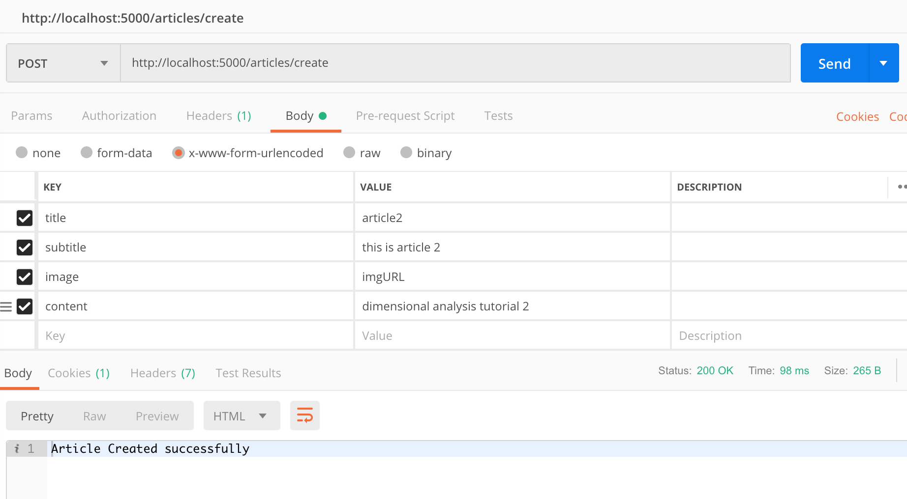
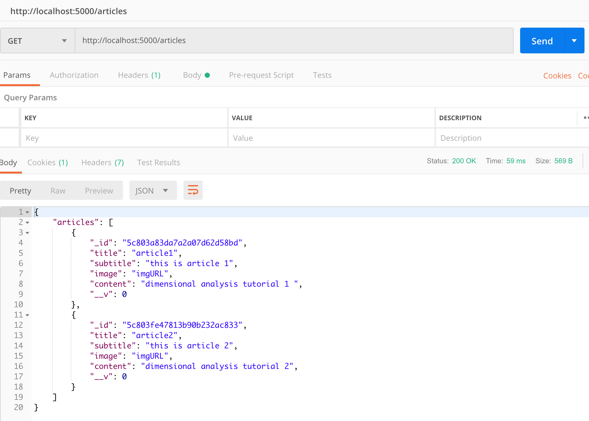
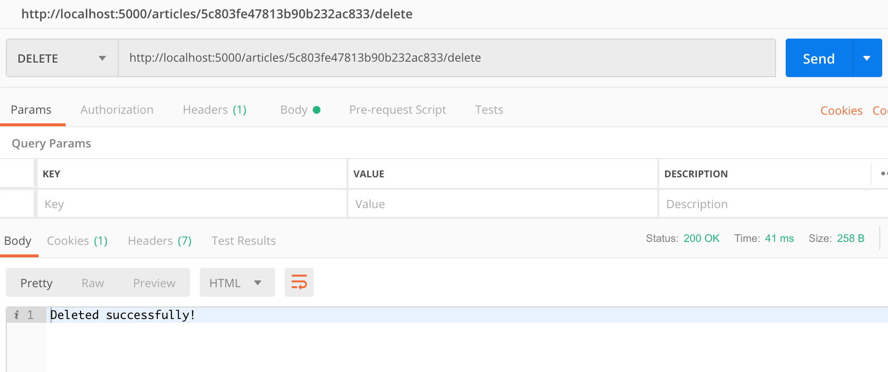

# Node.js Server Architecture

Model - abstract representation of the object\
Controller - flow of application execution\
Route - maps controller functions\

## Create Article

## Get Articles

## Delete Article

